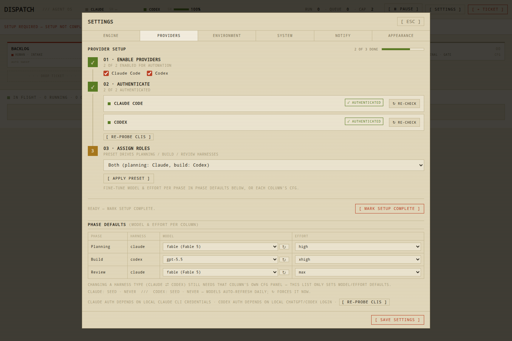

# Dispatch

Dispatch is a self-hostable Kanban-style runner for AI agent pipelines.

- **Planning**: define requirements and approach per ticket.
- **Build**: run an agent against your repository.
- **Review**: summarize, validate, and hand off for completion.

Each phase (column) has a harness configuration (`claude` / `codex` / `human`) and moves one ticket at a time.

---

## Requirements

- Node.js 20+
- Git
- Optional providers:
  - [Claude Code CLI](https://claude.ai) (for Claude)
  - [Codex CLI](https://openai.com) (for Codex)

## Quick Start

```bash
	git clone https://github.com/starbirdbeats/dispatch.git
cd dispatch
npm ci
npm start
```

Open [http://localhost:4400](http://localhost:4400).

### Environment

Copy and customize `.env.example` for your machine:

```bash
cp .env.example .env
```

Then edit:

- `DISPATCH_DATA` (defaults to `~/dispatch-data`)
- `DISPATCH_PORT` (defaults to `4400`)
- `DISPATCH_ENV_FILE` (defaults to `.env`)

Optional:

- `DISPATCH_PUBLIC_URL` (for Telegram links)
- `TELEGRAM_BOT_TOKEN`, `TELEGRAM_CHAT_ID`

`.env` is not committed and is loaded from the app’s working directory.

## Setup for First Run

When you run Dispatch the first time, open **SETTINGS** → **PROVIDERS**. The tab is a
three-step guided stepper — each step unlocks as the one before it is done:

1. **Enable providers**
   - Turn `Claude Code` on/off for automation
   - Turn `Codex` on/off for automation

2. **Authenticate** — subscription sign-in, straight from the UI
   - Each enabled provider shows a status pill (authenticated / not authenticated)
   - **AUTHENTICATE →** starts the provider's own login on the Dispatch host
     (`claude auth login` / `codex login`) and opens its sign-in URL in a new tab
   - **Claude**: sign in with your Claude subscription; the page shows a one-time
     code — paste it into the row and hit **SUBMIT CODE →** (works from any device)
   - **Codex**: finish the ChatGPT sign-in in the opened tab; the flow calls back to
     the Dispatch machine, so use a browser on that host
   - The row flips to **✓ AUTHENTICATED** by itself — no reload, no re-check needed
     (**RE-CHECK** and **CANCEL** are there for manual control)

3. **Assign roles** — pick a pipeline preset, then **MARK SETUP COMPLETE**
   - **Both**: Planning=Claude, Build=Codex, Review=Claude
   - **Claude only**: all phases use Claude
   - **Codex only**: all phases use Codex
   - Presets are just shortcuts — **PHASE DEFAULTS** (below the stepper) lets each
     phase run any harness (Claude, Codex, or human) with its own model and effort
   - *Mark setup complete* stays gated until steps 1 & 2 are done

On narrow screens the rail collapses, the step number moves inline, and the tab bar
becomes a horizontal scroll strip.

Screenshots generated by `npm run screenshots`:
- Board overview: `docs/screenshots/board-overview.png`
- Guided setup stepper: `docs/screenshots/setup-provider-stepper.png`
- Preset example: `docs/screenshots/setup-preset-claude-only.png`
- Provider toggle flow: `docs/screenshots/setup-auth-toggle-example.png`



## Provider behavior and auth

Dispatch does not store provider credentials itself — logins run through each CLI's own
flow and land wherever that CLI keeps them (keyring / config dir).

- **Claude** auth is detected with `claude auth status` (with the OAuth token file and
  `ANTHROPIC_API_KEY`/`CLAUDE_CODE_OAUTH_TOKEN` as fallbacks for older CLIs).
- **Codex** auth is detected with `codex login status`.
- Setup warnings show current state:
  - not installed
  - installed but not authenticated
  - authenticated

If a phase uses a disabled provider, Dispatch will pause that phase and ask for Setup before continuing.

The top usage strip is separate from Settings auth. Claude agent runs can be authenticated
through the CLI/keyring even when Dispatch cannot read an OAuth token for Anthropic account
usage APIs; in that case the usage meters show unavailable rather than treating Claude as
logged out. Set `CLAUDE_CODE_OAUTH_TOKEN` only if you intentionally want Dispatch to use a
readable Claude OAuth token for usage/model enrichment.

## Data and secrets

- Board + tickets are stored in `DISPATCH_DATA` (defaults to `~/dispatch-data`).
- Secrets come from:
  - `.env` (repo working directory or `DISPATCH_ENV_FILE`)
  - Environment variables injected by your service definition
- Secrets are never committed.

## Notifications (Telegram)

Dispatch can ping you on ticket completion or when a ticket needs intervention. Set it up once:

1. **Create a bot.** Message [@BotFather](https://t.me/BotFather) on Telegram, send `/newbot`, and follow the prompts. It replies with a bot token that looks like `123456789:AAExampleTokenString`.
2. **Set the token.** Add it as `TELEGRAM_BOT_TOKEN` in your `.env` (or the service unit's environment) — the token is never entered in the Dispatch UI, only read from the environment.
3. **Start a chat with your bot.** Search for its username in Telegram and send `/start`. Bots can't message you until you've messaged them first.
4. **Get your chat ID.** Easiest path: message [@userinfobot](https://t.me/userinfobot) and it replies with your numeric ID. Alternatively, send your new bot any message, then open `https://api.telegram.org/bot<TOKEN>/getUpdates` in a browser and read `message.chat.id` from the JSON response.
5. **Wire it up in Dispatch.** Open **SETTINGS** → **NOTIFY**, paste the chat ID into **CHAT ID** (or set `TELEGRAM_CHAT_ID` as an env var instead — the env var wins if both are set), toggle **TELEGRAM ALERTS** on, pick which events to ping on, and hit **[ SEND TEST ]** to confirm delivery.

## Deployment examples

### 1) Local process

```bash
DISPATCH_PORT=4400 npm start
```

### 2) Systemd user service

Copy the example service:

```bash
cp deploy/dispatch.service ~/.config/systemd/user/dispatch.service
```

Edit:
- `ExecStart` (path to `node`)
- `WorkingDirectory` (where you cloned Dispatch)
- `EnvironmentFile` (path to your non-secret env file)
- `Environment=` values as needed

Then enable:

```bash
systemctl --user daemon-reload
systemctl --user enable --now dispatch.service
systemctl --user status dispatch.service
```

For restart logs:

```bash
journalctl --user -u dispatch.service -f
```

## Verification

Use the test scripts before deploying publicly:

```bash
npm test
npm run test:e2e
npm run screenshots
```

`npm test` includes unit checks for:

- provider probing (installed/authenticated detection)
- runner disabled-provider parking behavior
- model registry parsing and refresh semantics

`npm run test:e2e` validates:

- Setup section renders
- Provider cards and re-check flow
- Preset assignment
- Disabled-provider warning behavior in phase CFG
- URL-state routing: every modal/tab is reflected in `location.hash`, a hard refresh
  restores it, and Back/Forward walk modal history without ever navigating out of the app
- Responsive board: at ≥760px the board splits into a scrollable pipeline rail in the top half
  and a scrollable in-flight tracker pinned to the bottom half; at <760px it collapses to one
  phase per screen with prev/next + dot pager + swipe, while the in-flight tracker stays pinned
  to the bottom

`npm run screenshots` regenerates `docs/screenshots/*.png` for the README setup flow.

## Responsive board

The board adapts at a **760px** breakpoint:

- **Desktop (≥760px)** — a horizontal *pipeline rail*: each phase is a station (accent-coloured
  by role/harness) showing its ticket chips, connected by `▸`. The rail is pinned to the top
  half of the board and each station scrolls vertically when it has more tickets than fit.
  Below it, an *in-flight tracker* stays pinned to the bottom half and scrolls its running/queued
  rows with a per-ticket phase-progress bar and live `T+` elapsed.
- **Mobile (<760px)** — one phase per screen with `‹ ›` controls, a dot pager, and swipe to move
  along the line; tickets render as full-width cards above a bottom-pinned in-flight tracker
  that scrolls its own running/queued rows.

Both views share the same click/drag wiring: clicking a chip, card, or tracker row opens the
ticket modal (and updates the URL), and station `CFG` opens the phase config.

## Layout

- `server.mjs` — API + WebSocket server
- `store.mjs` — board, ticket, and settings persistence
- `registry.mjs` — model registry and CLI probing
- `engine/runner.mjs` — queueing and run lifecycle
- `engine/claude.mjs` — Claude execution adapter
- `engine/codex.mjs` — Codex execution adapter
- `public/` — browser app (no build step)

## Design documents

- [`docs/models-registry.md`](docs/models-registry.md) — model discovery, fallback, and freshness
- [`docs/zero-orphan-runs.md`](docs/zero-orphan-runs.md) — restart-safe run lifecycle proposal
- [`docs/central-integration-worktree.md`](docs/central-integration-worktree.md) — serialized branch
  integration and publishing proposal

## Notes for forks and self-hosting

- Keep secrets out of git and local data.
- Use the SETUP section to enable only providers you can authenticate.
- For reproducible public deploys, keep `publish` and branch history clean.
- If you need a different default phase layout, update `store.mjs` (`DEFAULT_BOARD`) or edit `board.json` in `DISPATCH_DATA`.
