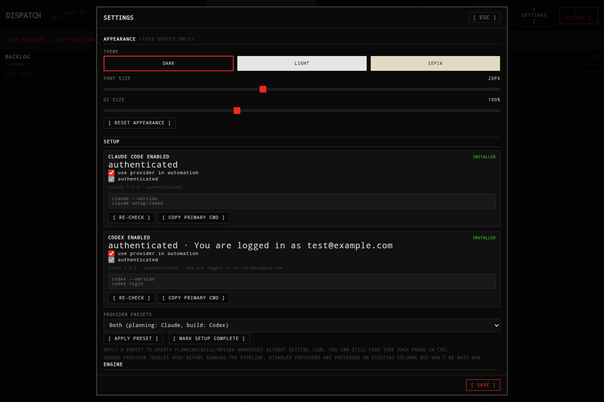

# Dispatch

Dispatch is a self-hostable Kanban-style runner for AI agent pipelines.

- **Planning**: define requirements and approach per ticket.
- **Build**: run an agent against your repository.
- **Review**: summarize, validate, and hand off for completion.

Each phase (column) has a harness configuration (`claude` / `codex` / `human`) and moves one ticket at a time.

---

## Requirements

- Node.js 20+
- Git
- Optional providers:
  - [Claude Code CLI](https://claude.ai) (for Claude)
  - [Codex CLI](https://openai.com) (for Codex)

## Quick Start

```bash
	git clone https://github.com/starbirdbeats/dispatch.git
cd dispatch
npm ci
npm start
```

Open [http://localhost:4400](http://localhost:4400).

### Environment

Copy and customize `.env.example` for your machine:

```bash
cp .env.example .env
```

Then edit:

- `DISPATCH_DATA` (defaults to `~/dispatch-data`)
- `DISPATCH_PORT` (defaults to `4400`)
- `DISPATCH_ENV_FILE` (defaults to `.env`)

Optional:

- `DISPATCH_PUBLIC_URL` (for Telegram links)
- `TELEGRAM_BOT_TOKEN`, `TELEGRAM_CHAT_ID`

`.env` is not committed and is loaded from the app’s working directory.

## Setup for First Run

When you run Dispatch the first time, open **SETTINGS** → **PROVIDERS** and complete three decisions:

1. **Enable providers**
   - Turn `Claude Code` on/off
   - Turn `Codex` on/off
   - Re-check status in the same card

2. **Choose a pipeline preset**
   - **Both**: Planning=Claude, Build=Codex, Review=Claude
   - **Claude only**: all phases use Claude
   - **Codex only**: all phases use Codex

3. **Mark setup complete**

Screenshots generated by `npm run screenshots`:
- Board overview: `docs/screenshots/board-overview.png`
- Provider cards: `docs/screenshots/setup-provider-cards.png`
- Preset example: `docs/screenshots/setup-preset-claude-only.png`
- Provider toggle flow: `docs/screenshots/setup-auth-toggle-example.png`



## Provider behavior and auth

Dispatch does not store provider credentials itself.

- **Claude** auth is read from the local Claude OAuth token file.
- **Codex** auth is detected with `codex login status`.
- Setup warnings show current state:
  - not installed
  - installed but not authenticated
  - authenticated

If a phase uses a disabled provider, Dispatch will pause that phase and ask for Setup before continuing.

## Data and secrets

- Board + tickets are stored in `DISPATCH_DATA` (defaults to `~/dispatch-data`).
- Secrets come from:
  - `.env` (repo working directory or `DISPATCH_ENV_FILE`)
  - Environment variables injected by your service definition
- Secrets are never committed.

## Notifications (Telegram)

Dispatch can ping you on ticket completion or when a ticket needs intervention. Set it up once:

1. **Create a bot.** Message [@BotFather](https://t.me/BotFather) on Telegram, send `/newbot`, and follow the prompts. It replies with a bot token that looks like `123456789:AAExampleTokenString`.
2. **Set the token.** Add it as `TELEGRAM_BOT_TOKEN` in your `.env` (or the service unit's environment) — the token is never entered in the Dispatch UI, only read from the environment.
3. **Start a chat with your bot.** Search for its username in Telegram and send `/start`. Bots can't message you until you've messaged them first.
4. **Get your chat ID.** Easiest path: message [@userinfobot](https://t.me/userinfobot) and it replies with your numeric ID. Alternatively, send your new bot any message, then open `https://api.telegram.org/bot<TOKEN>/getUpdates` in a browser and read `message.chat.id` from the JSON response.
5. **Wire it up in Dispatch.** Open **SETTINGS** → **NOTIFY**, paste the chat ID into **CHAT ID** (or set `TELEGRAM_CHAT_ID` as an env var instead — the env var wins if both are set), toggle **TELEGRAM ALERTS** on, pick which events to ping on, and hit **[ SEND TEST ]** to confirm delivery.

## Deployment examples

### 1) Local process

```bash
DISPATCH_PORT=4400 npm start
```

### 2) Systemd user service

Copy the example service:

```bash
cp deploy/dispatch.service ~/.config/systemd/user/dispatch.service
```

Edit:
- `ExecStart` (path to `node`)
- `WorkingDirectory` (where you cloned Dispatch)
- `EnvironmentFile` (path to your non-secret env file)
- `Environment=` values as needed

Then enable:

```bash
systemctl --user daemon-reload
systemctl --user enable --now dispatch.service
systemctl --user status dispatch.service
```

For restart logs:

```bash
journalctl --user -u dispatch.service -f
```

## Verification

Use the test scripts before deploying publicly:

```bash
npm test
npm run test:e2e
npm run screenshots
```

`npm test` includes unit checks for:

- provider probing (installed/authenticated detection)
- runner disabled-provider parking behavior
- model registry parsing and refresh semantics

`npm run test:e2e` validates:

- Setup section renders
- Provider cards and re-check flow
- Preset assignment
- Disabled-provider warning behavior in phase CFG
- URL-state routing: every modal/tab is reflected in `location.hash`, a hard refresh
  restores it, and Back/Forward walk modal history without ever navigating out of the app

`npm run screenshots` regenerates `docs/screenshots/*.png` for the README setup flow.

## Layout

- `server.mjs` — API + WebSocket server
- `store.mjs` — board, ticket, and settings persistence
- `registry.mjs` — model registry and CLI probing
- `engine/runner.mjs` — queueing and run lifecycle
- `engine/claude.mjs` — Claude execution adapter
- `engine/codex.mjs` — Codex execution adapter
- `public/` — browser app (no build step)

## Notes for forks and self-hosting

- Keep secrets out of git and local data.
- Use the SETUP section to enable only providers you can authenticate.
- For reproducible public deploys, keep `publish` and branch history clean.
- If you need a different default phase layout, update `store.mjs` (`DEFAULT_BOARD`) or edit `board.json` in `DISPATCH_DATA`.
